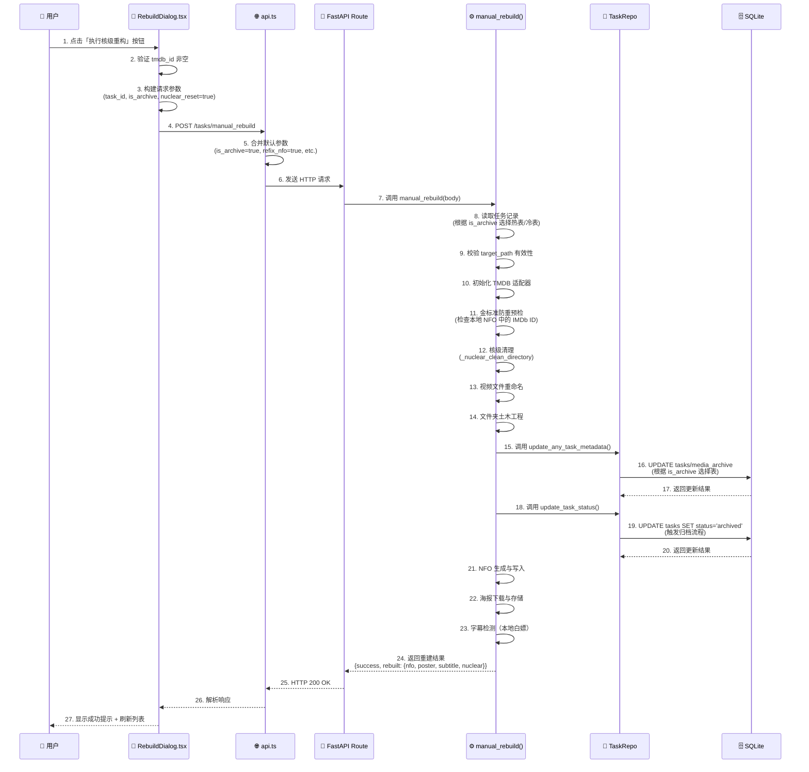
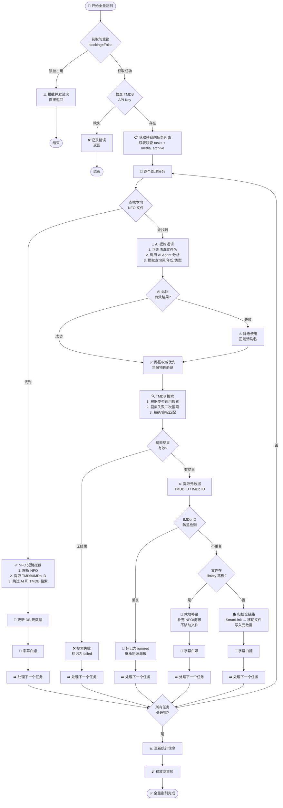
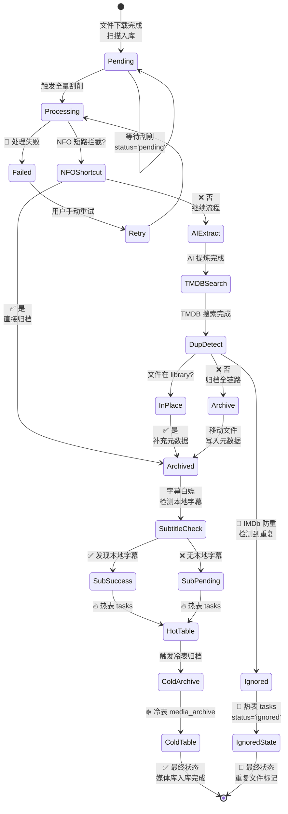
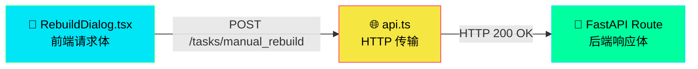
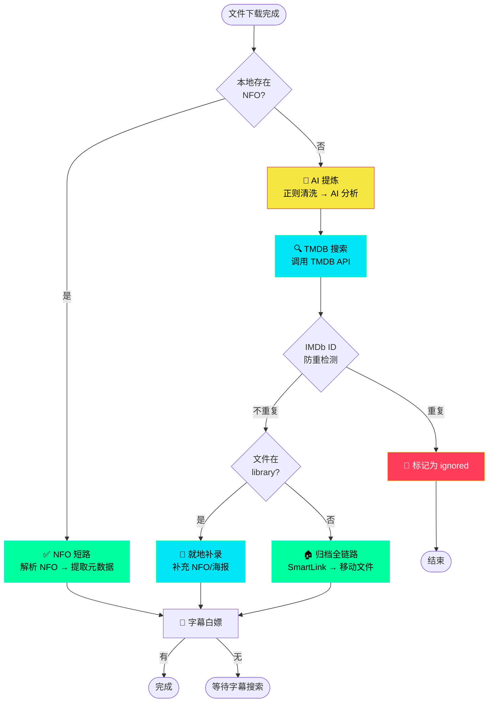

# DEV-ARCH-001 全栈逻辑交互拓扑蓝图

**文档编号**：DEV-ARCH-001  
**日期**：2026-03-16  
**状态**：✅ 架构绘图完成（含可视化图表）

---

## 📋 文档概述

本文档基于全栈源码级注释（Phase 1-1.6），使用 Mermaid.js 绘制多张核心业务流程图，展示 Neon-Crate 系统的完整交互拓扑。

---

## 图表 1：核级重构完整生命周期（时序图）

**场景**：用户在前台触发「核级重构 (Nuclear Rebuild)」直到后端完成并写入数据库的完整生命周期。



---

## 图表 2：全量刮削引擎核心流程（决策树）

**场景**：`perform_scrape_all_task_sync` 的内部运转机制。



---

## 图表 3：冷热双表数据流转（状态图）

**场景**：一个媒体文件从下载完成到最终入库的状态流转。



---

## 📊 核心数据契约与可视化

### 前后端数据传递流程



### 数据库双表架构

```mermaid
graph TB
    subgraph Hot["🔥 热表 (tasks)"]
        H1["id (PK)"]
        H2["status: pending/archived/failed/ignored"]
        H3["is_archive: 0"]
        H4["target_path"]
    end
    
    subgraph Cold["❄️ 冷表 (media_archive)"]
        C1["original_task_id (PK)"]
        C2["status: archived (固定)"]
        C3["is_archive: 1"]
        C4["target_path"]
    end
    
    Hot -.->|archive_task()| Cold
    
    style Hot fill:#ff3c5a,stroke:#00e6f6,color:#fff
    style Cold fill:#00e6f6,stroke:#00ff9f,color:#000
```

### 关键业务流程



---

## 🔄 关键业务流程总结表

| 流程 | 触发条件 | 关键操作 | 输出状态 |
|------|---------|---------|---------|
| **NFO 短路** | 本地存在 NFO 文件 | 解析 NFO → 提取元数据 → 跳过 AI/TMDB | archived |
| **AI 提炼** | NFO 不存在 | 正则清洗 → AI 分析 → 提取查询词 | processing |
| **TMDB 搜索** | AI 提炼完成 | 调用 TMDB API → 精确/宽松匹配 | 获得 TMDB/IMDb ID |
| **防重拦截** | 获得 IMDb ID | 检查 check_media_exists → 若重复标记 ignored | ignored |
| **就地补录** | 文件在 library 路径 | 补充 NFO/海报 → 不移动文件 | archived |
| **归档全链路** | 文件在下载目录 | SmartLink → 移动文件 → 写入元数据 | archived |
| **字幕白嫖** | 归档完成 | 检测本地字幕 → 若有标记 success | success/pending |

---

*Neon-Crate | DEV-ARCH-001 | 2026-03-16 | 含可视化图表*
