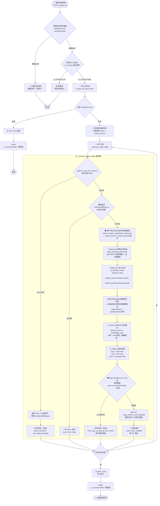
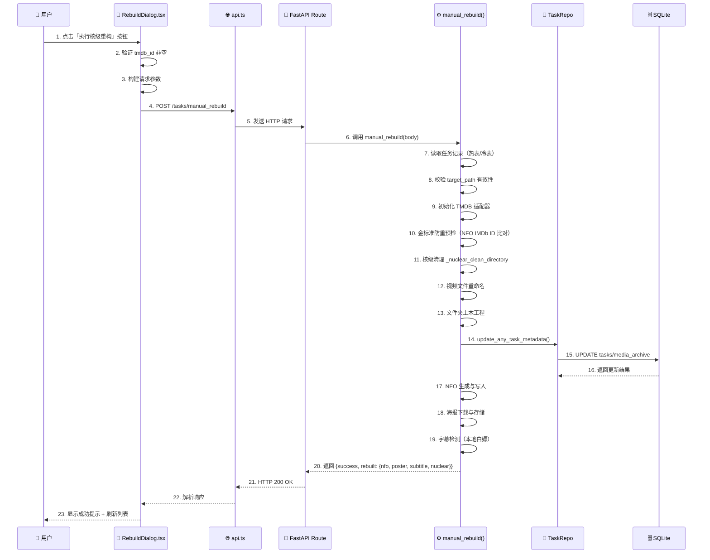
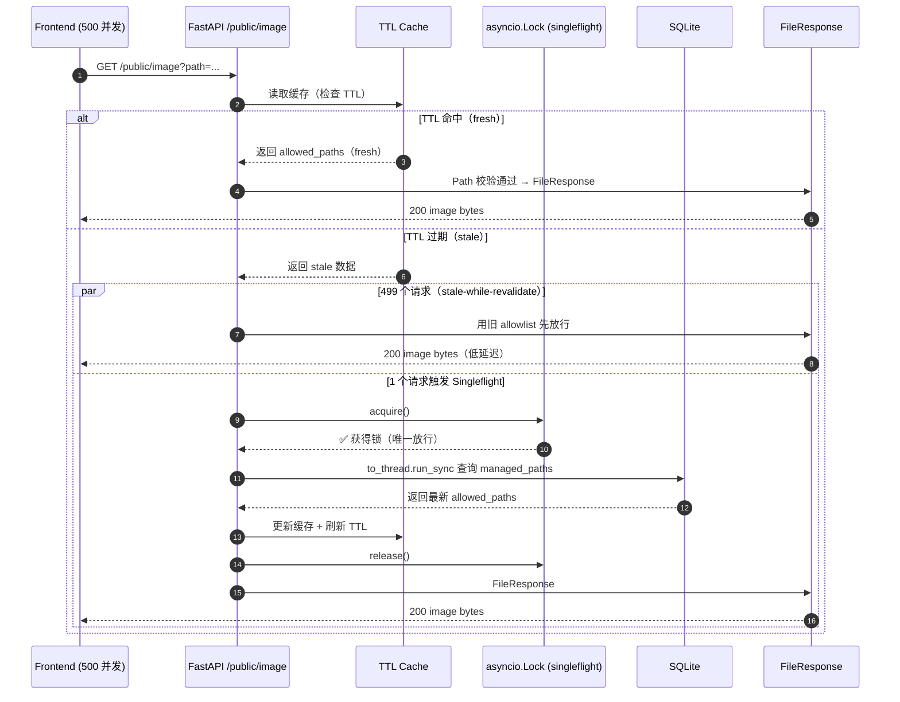
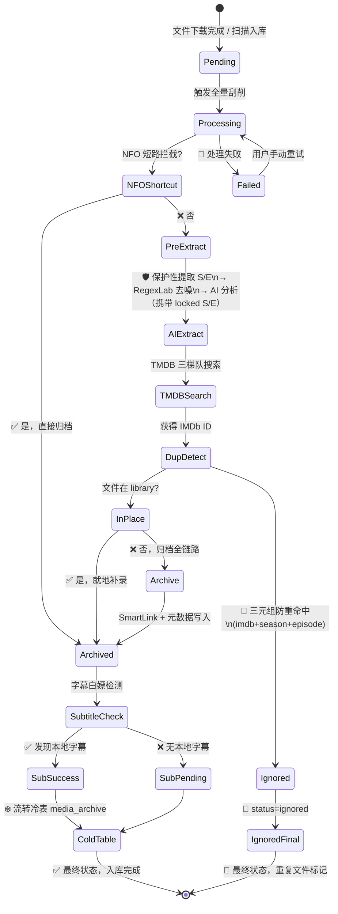
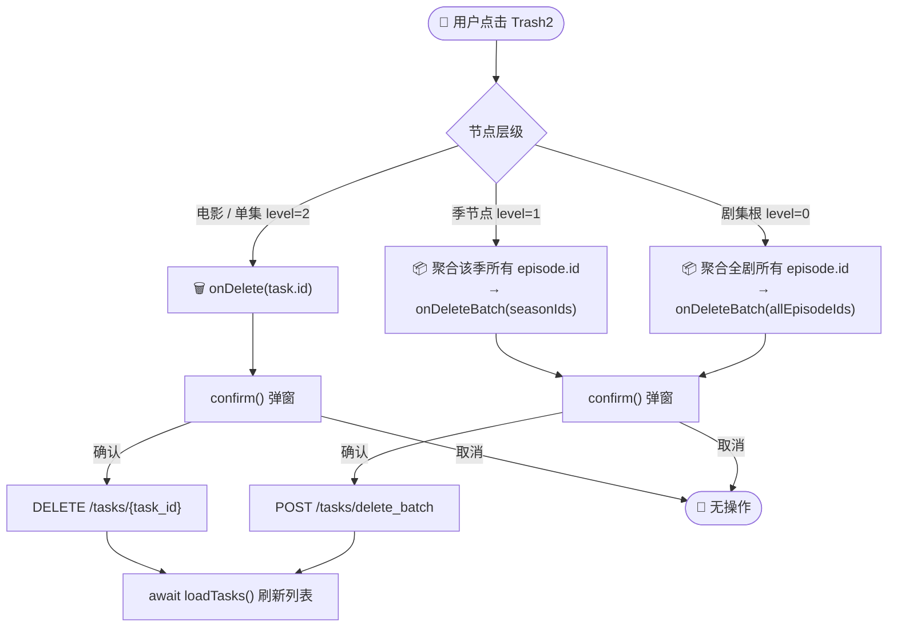

# 全栈逻辑交互拓扑蓝图

**文档编号**：ARCH-004（原 DEV-ARCH-001，文件名沿用仓库路径 `04_全栈逻辑交互拓扑蓝图.md`）  
**最后更新**：2026-03-20  
**状态**：与当前刮削 / 鉴权 / 图片代理代码一致；手动补录与全量重建见 `rebuilder` 与 `02_API规范与鉴权.md` 第四节

---

## 📋 文档概述

本文档基于全栈源码级注释，使用 Mermaid.js 绘制核心业务流程图，展示 Neon-Crate 系统的完整交互拓扑。

> **v1.0.0-Atomic 新增**：刮削流水线现已引入「原子级识别协议」，在 AI 分析之前物理锁定季集号，彻底消除集数信息被正则误删的根因问题。

---

## 🛡️ 原子级识别协议 (Atomic Identification Protocol)

> 本节描述 v1.0.0-Atomic 引入的核心识别机制升级，解决了剧集集数被正则误删导致 IMDb 查重熔断的根因问题。

### 问题根因

以文件名 `Joy of Life 2019 S01 E01 1080p WEB-DL AVC AAC LC-MayiWeb.mp4` 为例：

- `S01` 与 `E01` 之间有**空格**，旧规则 10 `[Ss](\d{1,2})[Ee](\d{1,3})` 无法匹配此格式
- 规则 13 `[Ee][Pp]?[\s\._-]*(\d{1,3})` 单独命中 `E01` 并将其**物理删除**
- AI 收到的已是不含集号的残缺文件名，无法提取 Episode
- 后端防重检测缺少集号 → 触发 IMDb 查重熔断 → 误标为 `ignored`

### 三层修复协议

#### 层 1：[EXTRACT] 规则隔离

`filename_clean_regex` 规则库现支持**行为标记**：注释行中含 `[EXTRACT]` 的规则为**提取专用规则**，仅参与结构化提取，**不参与** `clean_name()` 物理删除。

```
# --- 规则 10-15：仅提取用，clean_name 不执行删除 ---
# 10. [EXTRACT] 季集-S01E01格式（含空格变体 S01 E01）
[Ss](\d{1,2})[\s\._-]*[Ee](\d{1,3})

# 13. [EXTRACT] 季集-EP01格式
[Ee][Pp]?[\s\._-]*(\d{1,3})
```

**如何自定义 `[EXTRACT]` 规则**：在 RegexLab 中，于规则行**上方**添加以 `# [EXTRACT]` 开头的注释行。该规则将只用于 `extract_season_episode()` 等提取方法，不会在 `clean_name()` 中执行删除。

`_load_patterns()` 识别逻辑：

```python
for line in raw.splitlines():
    if line.strip().startswith('#'):
        is_extraction_rule = '[EXTRACT]' in line
        continue
    if is_extraction_rule:
        continue  # 跳过，不加入 _filter_patterns
    self._filter_patterns.append(re.compile(line, re.IGNORECASE))
```

#### 层 2：保护性前置提取 (Pre-extraction)

在 `_step_ai_extraction()` 中，**任何正则删除发生之前**，系统先对原始文件名物理提取 Season/Episode 并缓存：

```python
# ── 保护性提取：在任何正则删除之前，先物理提取 S/E ──
_pre_season, _pre_episode = _cleaner.extract_season_episode(raw_filename)
if _pre_season is not None or _pre_episode is not None:
    if _pre_season  is not None and task.get("season")  is None:
        task["season"]  = _pre_season
    if _pre_episode is not None and task.get("episode") is None:
        task["episode"] = _pre_episode

# 此后才执行正则去噪
cleaned_filename = _cleaner.clean_name(raw_filename)
```

#### 层 3：季集锁定护盾 (S/E Lock Shield)

AI 返回结果后，若正则已明确提取到 S/E，强制覆盖 AI 输出，AI 无权修改或丢弃：

```python
if _locked_season is not None:
    ai_result["season"] = _locked_season   # AI 建议被覆盖
if _locked_episode is not None:
    ai_result["episode"] = _locked_episode  # AI 建议被覆盖
```

`locked_season`/`locked_episode` 同样透传至 `ai_identify_media()` 的所有降级分支（JSON 解析失败、语义 FAIL 等），确保任何路径下集号不丢失。

### TV 重复检测三元组修复

当 `type='tv'` 且 `episode_num is None` 时，跳过 `check_media_exists()` 防重逻辑，进入待定状态：

```python
if refined_type == "tv" and episode_num is None:
    pass  # 缺集号，跳过防重，继续归档
elif imdb_id and db.check_media_exists(imdb_id, refined_type, season_num, episode_num):
    # 三元组（imdb_id + season + episode）精确命中 → 才执行防重
    db.mark_task_as_ignored_and_inherit(...)
    return None
```

### 验证结果（测试文件名）

```
输入：Joy of Life 2019 S01 E01 1080p WEB-DL AVC AAC LC-MayiWeb.mp4
清洗：Joy of Life S01 E01 LC   ← 标题保留，技术噪声去除（S/E 不被删除）
S=1  E=1                        ← 正确提取，不再丢失
```

---

## 图表 1：全量刮削终极流水线 (The Ultimate Scrape Pipeline)

> v1.0.0-Atomic 升级版：含保护性提取、锁定护盾、三元组防重熔断。



---

## 图表 2：核级重构完整生命周期（时序图）

**场景**：用户触发「核级重构 (Nuclear Rebuild)」到后端完成写库的完整生命周期。



---

## 图表 3：单飞高并发防御阵列（Singleflight Concurrency Shield）

**场景**：前端 500 个并发请求 `/public/image` 拉取海报，TTL 缓存失效时仅允许 1 个协程访问 DB，其余走 stale-while-revalidate。



---

## 图表 4：前端量子态神经中枢（Neural Link State Sync）

```mermaid
graph LR
    subgraph Backend[后端信号源]
        S1[/GET /system/stats/]
        S2[/GET /tasks/*_status/]
        S3[/GET /tasks/list/]
    end

    subgraph Hub[前端量子态枢纽]
        H1[useNeuralLinkStatus\nSingleton Store]
        H2[Polling Loop\n单例轮询 + AbortController]
        H3[emit() 派发快照\n订阅者模式]
    end

    subgraph UI[订阅者（同频渲染）]
        U1[AiSidebar]
        U2[SystemMonitor]
        U3[MiniLog]
    end

    subgraph I18N[i18n 渲染层]
        T1[useLanguage().t]
        T2[动态键保护红线\nstatus_ / sub_status_ / ui_]
    end

    S1 --> H2
    S2 --> H2
    S3 --> H2
    H2 --> H1
    H1 --> H3
    H3 --> U1
    H3 --> U2
    H3 --> U3
    U1 --> T1
    U2 --> T1
    U3 --> T1
    T2 --> T1

    classDef src fill:#16213e,stroke:#00e6f6,color:#00e6f6;
    classDef hub fill:#0f3460,stroke:#00ff9f,color:#00ff9f;
    classDef ui fill:#1a1a2e,stroke:#f5e642,color:#f5e642;
    classDef i18n fill:#3d0000,stroke:#ff3c5a,color:#ff3c5a;
    class S1,S2,S3 src;
    class H1,H2,H3 hub;
    class U1,U2,U3 ui;
    class T1,T2 i18n;
```

---

## 图表 5：冷热双表数据流转（状态图）



---

## 图表 6：三级物理删除流

**场景**：用户点击 `MediaTable` 中任意层级的红色 Trash2 删除按钮。



| 层级 | 节点 | API 端点 | 备注 |
|------|------|---------|------|
| level=0（电影） | UniversalMediaRow | `DELETE /tasks/{id}` | 单条删除 |
| level=0（剧集根） | UniversalMediaRow | `POST /tasks/delete_batch` | 聚合全剧所有集 ID |
| level=1（季节点） | UniversalMediaRow | `POST /tasks/delete_batch` | 聚合该季所有集 ID |
| level=2（单集） | UniversalMediaRow | `DELETE /tasks/{id}` | 单条删除 |

> 批量删除仅删除数据库记录（`tasks` + `media_archive` 双表），**不删除物理文件**。

---

## 🔄 关键业务流程总结表

| 流程 | 触发条件 | 关键操作 | 输出状态 |
|------|---------|---------|----------|
| **NFO 短路** | 本地存在 NFO | 解析 NFO → 提取元数据 → 跳过 AI/TMDB | `(True, False)` |
| **极致省流** | archived + 缺 imdb_id + 有字幕 | 跳过全流程，零 Token | `(True, False)` |
| **原子提取** | 所有非 NFO 短路任务 | 保护性提取 S/E → RegexLab 去噪 → AI 分析（携带 locked S/E） | locked_season/episode |
| **AI 提炼** | 原子提取完成 | `_step_ai_extraction`：YEAR_MIRROR 镜像校验 | refined_query/year/type |
| **TMDB 搜索** | AI 提炼完成 | 三梯队降级搜索 → 精确/宽松匹配 | tmdb_data dict |
| **三元组防重** | 获得 IMDb ID | `check_media_exists(imdb_id, type, season, episode)` | `ignored` 或继续 |
| **就地补录** | 文件在 library 路径 | 补充 NFO/海报，不移动文件 | `archived` |
| **归档全链路** | 文件在下载目录 | SmartLink → NFO → 海报 → Fanart | `archived` |
| **字幕白嫖** | 归档完成 | `_check_local_subtitles` → 若有标记 scraped | `scraped`/`pending` |

---

## 📌 RegexLab `filename_clean_regex` 配置规范

### `[EXTRACT]` 标记使用方法

`filename_clean_regex` 中每条规则的行为由其**上方注释行**控制：

| 注释格式 | 行为 | 适用场景 |
|---------|------|----------|
| `# 普通注释` | **CLEAN** — 参与 `clean_name()` 删除 | 分辨率、编码、语言等噪声标签 |
| `# ... [EXTRACT] ...` | **EXTRACT** — 仅参与结构化提取，不删除 | 季集号、集数格式（S01E01 等） |

**示例**：

```
# 1. 分辨率标签过滤                          ← 普通规则，clean_name 会删除
\b(2160p|1080p|720p)\b

# 10. [EXTRACT] 季集-S01E01格式（含空格）    ← EXTRACT 规则，clean_name 不删除
[Ss](\d{1,2})[\s\._-]*[Ee](\d{1,3})
```

**当前默认规则分类**：

| 规则编号 | 类型 | 描述 |
|---------|------|------|
| 1–9 | CLEAN | 分辨率、编码、方括号标签、广告词、语言标签、制作组、年份 |
| 10–15 | **EXTRACT** | 所有季集号格式（S01E01、Season格式、1x01、EP01、中文格式、动漫格式）|

---

*Neon-Crate | DEV-ARCH-001 | 2026-03-18 | v1.0.0-Atomic*
