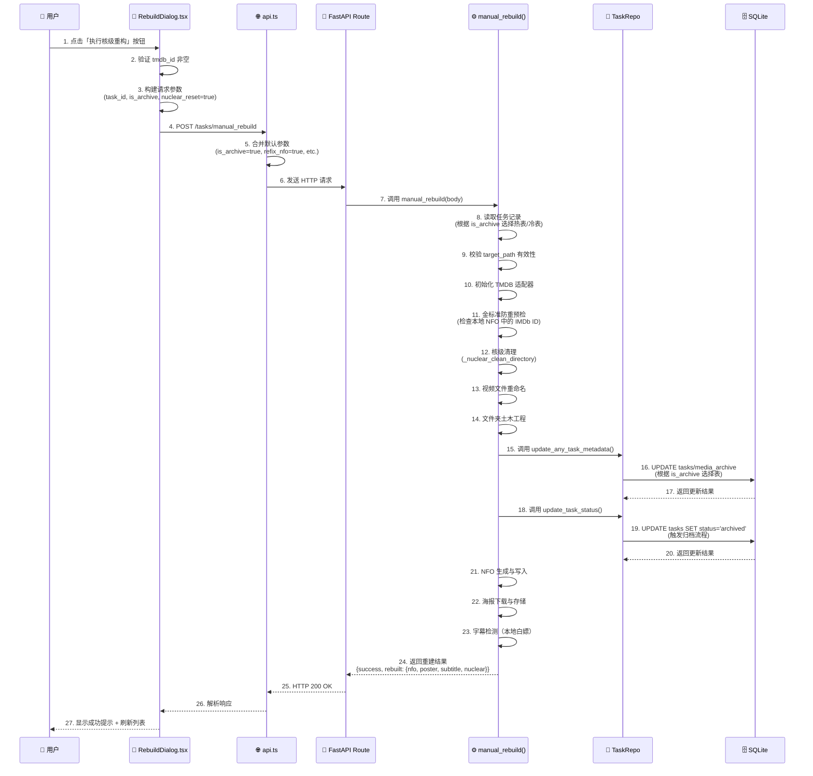
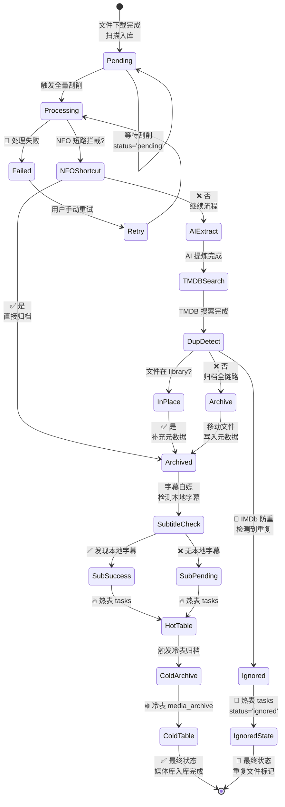
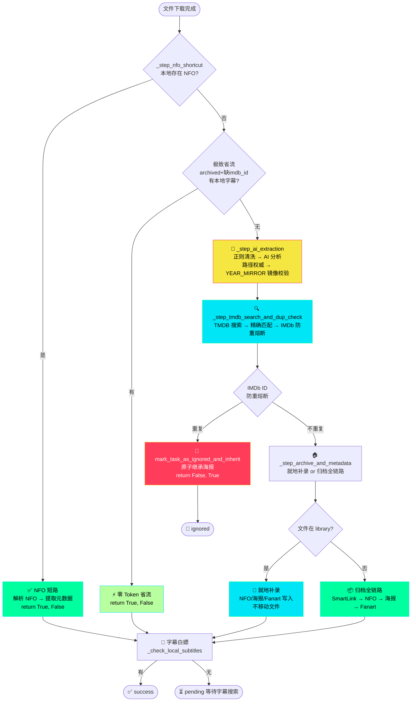
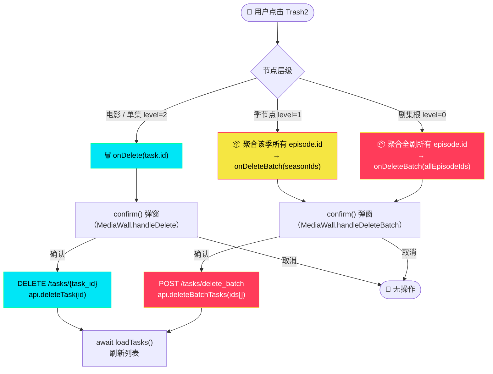

# DEV-ARCH-001 全栈逻辑交互拓扑蓝图

**文档编号**：DEV-ARCH-001  
**日期**：2026-03-16  
**状态**：✅ 架构绘图完成（含可视化图表）

---

## 📋 文档概述

本文档基于全栈源码级注释（Phase 1-1.6），使用 Mermaid.js 绘制多张核心业务流程图，展示 Neon-Crate 系统的完整交互拓扑。

---

## 图表 1：核级重构完整生命周期（时序图）

**场景**：用户在前台触发「核级重构 (Nuclear Rebuild)」直到后端完成并写入数据库的完整生命周期。



---

## 图表 2：全量刮削引擎核心流程（决策树）

**场景**：`perform_scrape_all_task_sync` + `_process_single_task` 编排器的内部运转机制（V2.0 流水线编排器架构）。

```mermaid
flowchart TD
    Start([🚀 开始全量刮削]) --> LockCheck{获取防重锁\nblockinng=False}
    LockCheck -->|锁被占用| Reject["⚠️ 拦截并发请求\n直接返回"]
    Reject --> End1([结束])

    LockCheck -->|获取成功| SecondCheck{🔒 锁内二次\n状态复检\n状态快照(dict)}
    SecondCheck -->|is_running=True| ReleaseLock1["🔓 主动释放锁\n退出（消除竞态窗口）"]
    ReleaseLock1 --> End1

    SecondCheck -->|is_running=False| SetRunning["✅ 写入运行态\nscrape_all_status['is_running']=True\n并清空 error"]
    SetRunning --> APICheck{检查 TMDB\nAPI Key}
    APICheck -->|缺失| APIFail["❌ set_error()\n返回"]
    APIFail --> Finally1["finally:\n写入 is_running=False\n释放锁"]
    Finally1 --> End2([结束])

    APICheck -->|存在| GetTasks["📋 获取待刮削任务列表\n双表联查 tasks + media_archive"]
    GetTasks --> TaskLoop["🔄 逐个处理任务\n_process_single_task()"]

    subgraph Orchestrator ["📦 编排器 _process_single_task()"
    ]
        direction TD
        Step1{_step_nfo_shortcut\n查找本地 NFO}
        Step1 -->|NFO 命中| NFOSuccess["✅ 解析 NFO（三层装甲）\n提取 tmdb/imdb/title/year"]
        NFOSuccess --> NFOClose["🧷 状态机闭环落库（终态）\nstatus=archived\nsub_status=success\nis_active=1\nreturn True, False"]
        Step1 -->|未命中| SubSaving{极致省流\narchived+缺imdb_id\n有本地字幕?}
        SubSaving -->|有字幕| SaveToken["⚡ 跳过刮削\n零 Token 消耗\nreturn True, False"]
        SubSaving -->|无字幕| Step2["🧠 _step_ai_extraction\n正则去噪→AI识别→路径权威\n→Year Mirror 年份护盾（冲突置空）"]
        Step2 --> TMDBTier["🔍 TMDB 三梯队降级\nTier-1 Title+Year\nTier-2 Title only\nTier-3 Truncated Title"]
        TMDBTier --> Step3["🧲 _step_tmdb_search_and_dup_check\n精确匹配→IMDb 防重熔断"]
        Step3 -->|None（失败）| ReturnFail["return False, True"]
        Step3 -->|物理副本命中| IgnoreClose["🧷 状态机闭环落库（终态）\nstatus=ignored\n继承存量海报\nsub_status=success\nis_active=1\nreturn False, True"]
        Step3 -->|tmdb_data| Step4["🏠 _step_archive_and_metadata\n就地补录 / 归档全链路\nSmartLink→NFO→海报→Fanart"]
        Step4 -->|target_path=None| ReturnFail
        Step4 -->|成功| SubCheck["🎁 字幕白嫖\n_check_local_subtitles\nreturn True, False"]
    end

    TaskLoop --> Step1
    NFOClose --> LoopEnd{所有任务\n处理完?}
    SaveToken --> LoopEnd
    ReturnFail --> LoopEnd
    IgnoreClose --> LoopEnd
    SubCheck --> LoopEnd

    LoopEnd -->|否| TaskLoop
    LoopEnd -->|是| UpdateStats["📊 finish_run(processed)\n原子写入统计"]
    UpdateStats --> Finally2["finally:\n写入 is_running=False\n释放锁"]
    Finally2 --> End3([✅ 全量刮削完成])
```

---

## 图表 3：冷热双表数据流转（状态图）

**场景**：一个媒体文件从下载完成到最终入库的状态流转。



---

## 📊 核心数据契约与可视化

### 前后端数据传递流程


### 数据库双表架构

```mermaid
graph TB
    subgraph Hot["🔥 热表 (tasks)"]
        H1["id (PK)"]
        H2["status: pending/archived/failed/ignored"]
        H3["is_archive: 0"]
        H4["target_path"]
    end
    
    subgraph Cold["❄️ 冷表 (media_archive)"]
        C1["original_task_id (PK)"]
        C2["status: archived (固定)"]
        C3["is_archive: 1"]
        C4["target_path"]
    end
    
    Hot -.->|archive_task()| Cold
    
    style Hot fill:#ff3c5a,stroke:#00e6f6,color:#fff
    style Cold fill:#00e6f6,stroke:#00ff9f,color:#000
```

### 关键业务流程



---

## 🔄 关键业务流程总结表

| 流程 | 触发条件 | 关键操作 | 输出状态 |
|------|---------|---------|---------|
| **NFO 短路** | 本地存在 NFO 文件 | `_step_nfo_shortcut`：解析 NFO → 提取元数据 → 跳过 AI/TMDB | `(True, False)` |
| **极致省流** | archived + 缺 imdb_id + 有本地字幕 | 跳过全流程，零 Token | `(True, False)` |
| **AI 提炼** | NFO/省流均未命中 | `_step_ai_extraction`：正则清洗 → AI 分析 → 路径权威 → YEAR_MIRROR 镜像校验 | 输出 refined_query/final_year/type |
| **TMDB 搜索** | AI 提炼完成 | `_step_tmdb_search_and_dup_check`：调用 TMDB API → 精确/宽松匹配 | 输出 tmdb_data dict |
| **防重拦截** | 获得 IMDb ID | `mark_task_as_ignored_and_inherit`（原子操作）→ 继承海报 | `(False, True)` |
| **就地补录** | 文件在 library 路径 | `_step_archive_and_metadata`：补充 NFO/海报 → 不移动文件 | archived |
| **归档全链路** | 文件在下载目录 | `_step_archive_and_metadata`：SmartLink → NFO → 海报 → Fanart | archived |
| **字幕白嫖** | 归档完成 | `_check_local_subtitles`：检测本地字幕 → 若有标记 success | success/pending |

---

## 图表 N：媒体库三级物理删除流（V16 新增）

**场景**：用户在 `MediaTable` 中点击任意层级的红色 Trash2 删除按钮，触发对应级别的物理删除流程。



**三级删除能力说明：**

| 层级 | 节点 | 前端逻辑 | API 端点 | 备注 |
|------|------|---------|---------|------|
| level=0（电影） | `UniversalMediaRow` | `onDelete(task.id)` | `DELETE /tasks/{id}` | 单条删除 |
| level=0（剧集根） | `UniversalMediaRow` | `onDeleteBatch(allEpisodeIds)` | `POST /tasks/delete_batch` | 聚合全剧所有集 ID |
| level=1（季节点） | `UniversalMediaRow` | `onDeleteBatch(seasonIds)` | `POST /tasks/delete_batch` | 聚合该季所有集 ID |
| level=2（单集） | `UniversalMediaRow` | `onDelete(ep.id)` | `DELETE /tasks/{id}` | 单条删除 |

> **架构要点**：删除按钮在所有层级**常驻显示**（红色 Trash2），无需展开即可操作。  
> 批量删除仅删除数据库记录（`tasks` + `media_archive` 双表），**不删除物理文件**。

---

*Neon-Crate | DEV-ARCH-001 | 2026-03-17 | 含可视化图表*
