# 全链路刮削数据流白皮书

**文档编号**：ARCH-DFD-001  
**版本**：v1.0.0（基于「6字段证据模型 + YEAR_MIRROR 镜像校验」架构）  
**最后更新**：2026-03-17  
**状态**：✅ 基于真实代码逆向生成

> 本文档追踪一个媒体文件从「被发现」到「生成 NFO 及海报」全生命周期中，数据载荷（Payload）在每一层的精确变形过程。

---

## 板块一：全景数据流 Mermaid 流程图

```mermaid
flowchart TD
    A(["📁 原始输入\n蝙蝠侠前传3黑暗骑士崛起 2012.1080p.BluRay.x264-WiKi.mkv"])

    A -->|"传递: file_name, file_path\nclean_name, media_type\n来自 tasks 表 + 路径配置"| B

    B["🧹 RegexLab 物理正则去噪\nMediaCleaner.clean_name()\n数据库驱动 15 条规则\n去扩展名→去组名→执行正则→截断SE→符号清理"]

    B -->|"传递: cleaned_filename='蝙蝠侠前传3黑暗骑士崛起'\nraw_filename 保留原始备用"| C

    C["🧠 AI Agent 语义识别\nai_identify_media()\n喂入: cleaned_filename + full_path\n+ parent_dir_hint + type_hint\nSystem Prompt = expert_archive_rules"]

    C -->|"传递: 6字段 JSON\n{query, type, season, episode,\nfilename_year, knowledge_year}"| D

    D["⚖️ YEAR_MIRROR 镜像校验裁决\nPython 后端执行，AI 仅举证\n对比 filename_year vs knowledge_year"]

    D -->|"movie + 两证据一致\n→ final_year='2012'"| E
    D -->|"movie + 两证据冲突\n→ final_year='' 模糊搜索"| E
    D -->|"tv + 强制对齐首播年\n→ final_year=knowledge_year"| E

    E["🔍 TMDB 搜索\nscraper.search_movie / search_tv\nquery=refined_query, year=final_year"]

    E -->|"传递: results 列表\n精确匹配→宽松匹配→results[0]"| F

    F["🛡️ IMDb 金标准防重熔断\nget_external_ids() → imdb_id\ncheck_media_exists(imdb_id, type, season, ep)"]

    F -->|"重复命中\n→ mark_task_as_ignored_and_inherit()\n原子继承海报"| Z1(["🚫 status=ignored\n海报已继承，流程终止"])
    F -->|"不重复\n传递: tmdb_data\n{tmdb_id, title, year, imdb_id}"| G

    G{"📍 文件位置判断\n文件在 library 路径?\nor status==archived?"}

    G -->|"是\n就地补录模式"| H1
    G -->|"否\n归档全链路"| H2

    H1["🏥 就地补录\n_step_archive_and_metadata()\n仅写 NFO + 海报 + Fanart\n不移动文件\n剧集: 元数据目录上升一级"]

    H2["📦 归档全链路\n_step_archive_and_metadata()\nSmartLink.create_link()\n硬链接→软链接→复制 三级降级\n电影: {library}/{title}({year})/\n剧集: {library}/{title}/Season{N:02d}/"]

    H1 -->|"传递: metadata_dir, tmdb_id\nmedia_type, target_path=原始路径"| I
    H2 -->|"传递: target_path（新路径）\nMetadataManager 初始化"| I

    I["📝 元数据写入\nMetadataManager.generate_nfo()\n→ movie.nfo / tvshow.nfo\ndownload_poster() → poster.jpg\ndownload_fanart() → fanart.jpg\n各步骤独立容错"]

    I -->|"写入完成\ntarget_path 已确认"| J

    J["💾 DB 状态回写\nupdate_task_status('archived')\nupdate_task_title_year()\narchive_task() → 流转冷表 media_archive"]

    J -->|"触发字幕检测"| K

    K["🎁 字幕白嫖检测\n_check_local_subtitles()\n检测 target_path 同级 .srt/.ass/.vtt"]

    K -->|"发现本地字幕"| Z2(["✅ sub_status='scraped'\n零 API 消耗"])
    K -->|"无字幕"| Z3(["⏳ sub_status='pending'\n进入字幕搜索队列"])

    style A fill:#1a1a2e,stroke:#00e6f6,color:#00e6f6
    style B fill:#16213e,stroke:#f5e642,color:#f5e642
    style C fill:#16213e,stroke:#00ff9f,color:#00ff9f
    style D fill:#0f3460,stroke:#ff3c5a,color:#ff3c5a
    style E fill:#16213e,stroke:#00e6f6,color:#00e6f6
    style F fill:#0f3460,stroke:#ff3c5a,color:#ff3c5a
    style G fill:#16213e,stroke:#f5e642,color:#f5e642
    style H1 fill:#16213e,stroke:#00ff9f,color:#00ff9f
    style H2 fill:#16213e,stroke:#00ff9f,color:#00ff9f
    style I fill:#16213e,stroke:#f5e642,color:#f5e642
    style J fill:#16213e,stroke:#00e6f6,color:#00e6f6
    style K fill:#16213e,stroke:#b8ff9f,color:#b8ff9f
    style Z1 fill:#3d0000,stroke:#ff3c5a,color:#ff3c5a
    style Z2 fill:#003d1a,stroke:#00ff9f,color:#00ff9f
    style Z3 fill:#1a1a00,stroke:#f5e642,color:#f5e642
```



---

## 板块二：核心数据结构演变（快照分析）

> **示例文件 A（电影）**：`蝙蝠侠前传3黑暗骑士崛起 2012.1080p.BluRay.x264-WiKi.mkv`  
> **示例文件 B（剧集）**：`Joy.of.Life.S02E10.2024.1080p.WEB-DL.mkv`

---

### Phase 0：扫描入库快照（ScanEngine 阶段）

```python
# MediaCleaner.clean_and_extract() + db.insert_task() 后的 tasks 表记录
{
    "id": 42,
    "path": "/downloads/蝙蝠侠前传3黑暗骑士崛起 2012.1080p.BluRay.x264-WiKi.mkv",
    "file_name": "蝙蝠侠前传3黑暗骑士崛起 2012.1080p.BluRay.x264-WiKi.mkv",
    "clean_name": "黑暗骑士崛起",  # 扫描阶段预清洗（仅供参考，刮削时会重新清洗）
    "year": 2012,                  # extract_year() 从文件名物理提取
    "season": None,
    "episode": None,
    "type": "movie",               # 路径配置 category=movie 注入
    "status": "pending",
    "is_archive": 0
}
```

---

### Phase 1：物理去噪后（RegexLab 输出）

> **代码位置**：`_step_ai_extraction()` → `MediaCleaner(db_manager=db).clean_name(raw_filename)`

**输入**：`蝙蝠侠前传3黑暗骑士崛起 2012.1080p.BluRay.x264-WiKi.mkv`

| 步骤 | 操作 | 中间结果 |
|------|------|----------|
| ① | 去扩展名 `.mkv` | `蝙蝠侠前传3黑暗骑士崛起 2012.1080p.BluRay.x264-WiKi` |
| ② | 去首部方括号组名 | （无，跳过） |
| ③ | 去剩余方括号内容 | （无，跳过） |
| ④ | DB 正则：分辨率 `1080p` | `蝙蝠侠前传3黑暗骑士崛起 2012. .BluRay.x264-WiKi` |
| ④ | DB 正则：发行版 `BluRay` | `蝙蝠侠前传3黑暗骑士崛起 2012. . .x264-WiKi` |
| ④ | DB 正则：编码 `x264` | `蝙蝠侠前传3黑暗骑士崛起 2012. . . -WiKi` |
| ④ | DB 正则：制作组后缀 `-WiKi` | `蝙蝠侠前传3黑暗骑士崛起 2012. . .  ` |
| ④ | DB 正则：年份清除 `2012` | `蝙蝠侠前传3黑暗骑士崛起 . . .  ` |
| ⑤ | 符号清理（点/横线→空格） | `蝙蝠侠前传3黑暗骑士崛起   ` |
| ⑥ | 压缩多余空格 + strip | `蝙蝠侠前传3黑暗骑士崛起` |

**Phase 1 输出**：

```python
cleaned_filename = "蝙蝠侠前传3黑暗骑士崛起"
# raw_filename 仍保留完整原始文件名，供 YEAR_MIRROR 的 filename_year 提取使用
```

---

### Phase 2：发给 AI 的 Prompt 载荷

> **代码位置**：`agent.py` → `ai_identify_media()` → `llm_client.call_llm()`

**System Prompt**（来自数据库 `expert_archive_rules` 字段，动态读取，约 2000 tokens）：

```
核心任务：智能影视归档专家
你负责将杂乱的影视文件路径清洗为标准的结构化数据，供 TMDB 搜索使用。

【寻猎者推理流（必须在输出前执行）】
- 特征剥离：清除资源站、压制组（FRDS, WiKi）、技术规格（10bit, x265）
- 系列名降维：蝙蝠侠前传3黑暗骑士崛起 → 核心标题是 黑暗骑士崛起
- 年份自愈：验证文件名年份与知识库是否相符，剧集强制对齐第一季首播年
- 翻译去幻觉：禁止直译，Spirited Away → 千与千寻

【强制输出契约】必须且只能输出包含以下 6 个键的 JSON：
  query / type / season / episode / filename_year / knowledge_year
```

**User Prompt**（运行时动态构建，代码位置 `agent.py` `call_llm` 调用处）：

```
请分析以下影视文件，严格按照 System Prompt 的 JSON 契约输出：
文件路径: /downloads/蝙蝠侠前传3黑暗骑士崛起 2012.1080p.BluRay.x264-WiKi.mkv
父目录名（强信号，通常即为作品名）: downloads
清洗后文件名: 蝙蝠侠前传3黑暗骑士崛起
类型提示: movie

⚠️ 关键提示：
1. 优先以【父目录名】作为作品名的参考依据
2. 对于剧集，query 只输出剧名本身，不含单集标题
3. filename_year 只能填写文件名或路径中明确出现的年份
4. knowledge_year 填写知识库认定的真实年份，与文件名无关
```

**AI 接收的完整上下文摘要**：

| 上下文字段 | 值 | 来源 |
|---|---|---|
| `full_path` | `/downloads/蝙蝠侠前传3黑暗骑士崛起 2012.1080p.BluRay.x264-WiKi.mkv` | `task["path"]` |
| `parent_dir_hint` | `downloads` | 路径逆向解析，跳过 Season XX 目录 |
| `cleaned_name` | `蝙蝠侠前传3黑暗骑士崛起` | RegexLab Phase 1 输出 |
| `type_hint` | `movie` | 路径配置 `category=movie` |
| System Prompt | `expert_archive_rules` 完整内容 | DB 动态读取 |

---

### Phase 3：AI 的 6 字段输出

> **代码位置**：`agent.py` → `_parse_json_response()` → `_classify_result()`

**LLM 返回 JSON**：

```json
{
  "query": "黑暗骑士崛起",
  "type": "movie",
  "season": null,
  "episode": null,
  "filename_year": "2012",
  "knowledge_year": "2012"
}
```

**`_classify_result()` 置信度裁定**：

| 检查项 | 值 | 结果 |
|---|---|---|
| query 是否为幻觉词 | `"黑暗骑士崛起"` 不在幻觉词表 | ✅ |
| query 长度 ≥ 2 | 6个字符 | ✅ |
| **置信度等级** | **PASS** | **直接放行，无需修复** |

**三级置信度完整说明**：

| 等级 | 触发条件 | 行为 |
|---|---|---|
| `PASS` | query 非空且不在幻觉词表，长度 ≥ 2 | 直接使用，进入 YEAR_MIRROR |
| `REPAIR` | query 为幻觉词（unknown/null等），但 knowledge_year 有效 | 用 `cleaned_name` 替换 query，放行 |
| `FAIL` | query 和 knowledge_year 均无效 | 完全降级为 `cleaned_name`，year 置空 |

---

### Phase 4：TMDB 最终请求参数

> **代码位置**：`_step_ai_extraction()` YEAR_MIRROR 裁决 → `_step_tmdb_search_and_dup_check()`

**YEAR_MIRROR 镜像校验裁决过程**：

```
类型:           movie
filename_year:  "2012"   ← AI 从路径字符串中物理看到的 4 位数字
knowledge_year: "2012"   ← AI 知识库认定：《黑暗骑士崛起》2012年公映

分支: movie + filename_year == knowledge_year
裁决: ✅ 两份证据一致 → final_year = "2012"
日志: [YEAR_MIRROR] 年份校验通过 (文件:2012 == 知识库:2012)，使用年份过滤。
```

**TMDB 搜索最终入参**：

```python
results = scraper.search_movie(
    query = "黑暗骑士崛起",  # AI 提炼的纯净片名（已去年份/技术标签）
    year  = "2012"           # YEAR_MIRROR 裁决的 final_year
)
# → 精确命中《The Dark Knight Rises》TMDB_ID=49521
```

**五种 YEAR_MIRROR 裁决场景对照**：

| 场景 | filename_year | knowledge_year | 裁决逻辑 | final_year |
|---|---|---|---|---|
| 正常电影（本例） | `"2012"` | `"2012"` | movie + 一致 ✅ | `"2012"` |
| 文件年份错误（如压制标注错年） | `"2005"` | `"2006"` | movie + 冲突 ⚠️ | `""` 模糊搜索 |
| 文件名无年份 | `""` | `"2012"` | movie + 单证据 🔵 | `"2012"` |
| 双空（古早片/无信息） | `""` | `""` | 证据不足 🔘 | `""` 模糊搜索 |
| 剧集第 2 季（庆余年 S02 2024） | `"2024"` | `"2019"` | tv → 强制首播年 📺 | `"2019"` |

---

## 板块三：防雪崩与异常处理兜底机制

### 3.1 全局容错矩阵

| 步骤 | 故障场景 | 兜底行为 | 代码位置 |
|---|---|---|---|
| RegexLab | DB 正则全部无效/加载失败 | 仍执行符号清理，返回部分清洗名 | `cleaner.py:_load_patterns()` |
| RegexLab | `cleaned_filename` 为空串 | 回退使用 `raw_filename` 原始文件名 | `scrape_task.py:L306` |
| AI 调用 | `asyncio.run()` 抛任何异常 | `ai_result = None`，进入降级通道 | `scrape_task.py:try/except ai_err` |
| AI 返回 | 返回 `None` 或非 dict | 降级使用 `cleaned_filename` 作 query，年份置空 | `scrape_task.py:ai_result fallback` |
| AI 返回 | JSON 解析失败（乱码/截断） | `_parse_json_response()` 返回 None → 同上 | `agent.py:_parse_json_response` |
| AI 返回 | query 为幻觉词但 year 有效 | `REPAIR`：用 `cleaned_name` 替换 query 后放行 | `agent.py:_classify_result` |
| AI 返回 | query 和 year 均无效 | `FAIL`：完全降级为正则清洗名 | `agent.py:_classify_result` |
| AI 返回 | type 字段为非法值 | 幻觉纠偏：film→movie，series/anime→tv | `agent.py:_MOVIE_ALIASES/_TV_ALIASES` |
| 路径权威 | AI 建议 type 与路径配置冲突 | 路径配置强制覆盖 AI 建议，记录日志 | `scrape_task.py:PATH_AUTHORITY` |
| TMDB 搜索 | 电影结果为 0 | 标记 `failed`，进入孤儿救援队列等待重试 | `_step_tmdb_search_and_dup_check` |
| TMDB 搜索 | **剧集结果为 0** | **二次重试**：取 query 首词重新搜索（去集号） | `scrape_task.py:fallback_query` |
| TMDB 搜索 | 429 限流 | 指数退避重试：2s→4s→8s，最多 3 次 | `http_utils.py` |
| TMDB 匹配 | 无精确匹配 | 宽松匹配（去末尾集号后比对）→ 兜底 `results[0]` | `_step_tmdb_search_and_dup_check` |
| IMDb 获取 | `get_external_ids()` 异常 | `imdb_id = ""`，跳过防重检测，继续归档 | `try/except` |
| SmartLink | 硬链接失败（跨分区） | 降级软链接 → 失败再降级文件复制 | `hardlinker.py:create_link()` |
| NFO 写入 | `generate_nfo()` 异常 | `logger.warning` 跳过，海报/Fanart 继续 | `_step_archive_and_metadata` |
| 海报下载 | `download_poster()` 超时/失败 | `logger.warning` 跳过，NFO 和 Fanart 继续，DB 照常写入 | `_step_archive_and_metadata` |
| 归档全链路 | `SmartLink` 返回 `None` | `target_path = None`，主流程 `return False, True`，标记 failed | `_step_archive_and_metadata` |
| 字幕检测 | 检测路径不存在 | 静默跳过，`sub_status='pending'` | `_check_local_subtitles` |

---

### 3.2 AI 识别失败完整降级链路

```
ai_identify_media() 调用失败
  │
  ├─► Exception 被捕获
  │     ai_result = None
  │     ↓
  ├─► ai_result 为 None / 非 dict
  │     ai_result = {
  │       "query": cleaned_filename,   # RegexLab 输出保底
  │       "type": media_type,          # DB 路径配置保底
  │       "filename_year": "",
  │       "knowledge_year": ""
  │     }
  │     ↓
  ├─► YEAR_MIRROR 裁决
  │     filename_year="" + knowledge_year="" → final_year=""
  │     ↓
  └─► TMDB 模糊搜索（无年份过滤）
        query = cleaned_filename（正则清洗名）
        year  = ""
        → 仍有机会命中正确结果
```

---

### 3.3 TMDB 剧集二次搜索机制

```
剧集首次搜索失败（results 为空）
  ↓
 fallback_query = refined_query.split(" ")[0]  # 取首个词
 例："庆余年 第二季" → "庆余年"
     "The Boys S03" → "The"
  ↓
 scraper.search_tv(query=fallback_query, year=refined_year)
  ↓
 若仍为空 → 标记 failed，等待手动重建
```

---

### 3.4 孤儿任务救援（Orphan Rescue）

```python
# perform_scrape_all_task_sync() 末尾执行
# 对所有超时仍处于 pending 状态的任务标记为 failed
db.reset_orphan_pending_tasks()
# 被救援的任务可通过前端「重试」按钮重新进入队列
```

---

### 3.5 NFO 短路拦截（极速通道）

> 当本地已存在 NFO 文件时，整个 AI + TMDB 链路被完全跳过：

```
_step_nfo_shortcut()
  ↓
 扫描 file_path 同级目录的 *.nfo 文件
  ↓
 解析 NFO 中的 <tmdbid> / <imdbid>
  ↓
 直接写库并归档
  ↓
 return True, False  # 短路成功，跳过 Step 2-4
```

**节省**：0 个 LLM Token + 0 次 TMDB API 调用。

---

## 附录：数据流关键日志标签速查

| 日志标签 | 含义 | 对应步骤 |
|---|---|---|
| `[RegexLab]` | 物理正则去噪完成 | Phase 1 |
| `[AI]` | AI 调用与结果 | Phase 2-3 |
| `[AI][KEYWORD_HINT]` | 用户手动覆盖片名 | keyword_hint 快速通道 |
| `[AI][FALLBACK]` | AI 失败降级 | 降级链路 |
| `[AI][PATH_AUTHORITY]` | 路径权威覆盖 AI 建议 | type 裁决 |
| `[AI][SEMANTIC_REPAIR]` | query 幻觉词修复 | REPAIR 分级 |
| `[AI][SEMANTIC_FAIL]` | query+year 双失效 | FAIL 分级 |
| `[AI][HALLUCINATION]` | type 字段幻觉纠偏 | type 映射 |
| `[YEAR_MIRROR]` | 年份镜像校验裁决 | Phase 4 |
| `[TMDB]` | TMDB 搜索与匹配 | Phase 4 |
| `[SKIP]` | IMDb 防重熔断命中 | 防重步骤 |
| `[ORG]` | 归档/就地补录操作 | Phase 5-6 |

---

*Neon Crate 架构组 | ARCH-DFD-001 | 2026-03-17 | 基于「6字段证据模型 + YEAR_MIRROR 镜像校验」架构*