# 全链路刮削数据流白皮书

**文档编号**：ARCH-DFD-001  
**版本**：v1.0.0-Atomic  
**最后更新**：2026-03-20  
**状态**：与自动刮削链路一致；**手动补录/全量重建**为独立 `rebuilder` 引擎，不在本图主路径内（参见 API 文档第四节）

> 本文档追踪一个媒体文件从「被发现」到「生成 NFO 及海报」全生命周期中，数据载荷（Payload）在每一层的精确变形过程。
>
> **v1.0.0-Atomic 新增**：在 RegexLab 去噪之前引入「保护性前置提取」，并在 AI 分析后施加「季集锁定护盾」，彻底消除集数信息被正则误删的根因问题。

---

## 板块一：全景数据流 Mermaid 流程图

```mermaid
flowchart TD
    A(["📁 原始输入\n蝙蝠侠前传3黑暗骑士崛起 2012.1080p.BluRay.x264-WiKi.mkv"])

    A -->|"file_name / file_path / clean_name / media_type"| B

    B["🛡️ [原子协议] 保护性前置提取\nextract_season_episode(raw_filename)\n→ locked_season / locked_episode 缓存\n在任何正则删除发生之前执行"]

    B -->|"locked_season=1, locked_episode=1\n（若提取到则缓存，否则 None）"| C

    C["🧹 RegexLab 物理正则去噪\nMediaCleaner.clean_name()\n[EXTRACT] 规则隔离：季集号规则不参与删除\n数据库驱动 9 条 CLEAN 规则"]

    C -->|"cleaned_filename='蝙蝠侠前传3黑暗骑士崛起'"| D

    D["🧠 AI Agent 语义识别\nai_identify_media(\n  cleaned_name, full_path,\n  locked_season, locked_episode\n)\nSystem Prompt = expert_archive_rules"]

    D -->|"返回 6 字段 JSON"| E

    E["🔒 [原子协议] 季集锁定护盾\nif locked_season is not None:\n    ai_result['season'] = locked_season\nif locked_episode is not None:\n    ai_result['episode'] = locked_episode\nAI 无权修改或丢弃正则锁定值"]

    E -->|"传递: 6字段 JSON\n{query, type, season, episode,\nfilename_year, knowledge_year}"| F

    F["⚖️ YEAR_MIRROR 镜像校验裁决\nPython 后端执行，AI 仅举证\n对比 filename_year vs knowledge_year"]

    F -->|"movie + 两证据一致 → final_year='2012'"| G
    F -->|"movie + 两证据冲突 → final_year='' 模糊搜索"| G
    F -->|"tv + 强制对齐首播年 → final_year=knowledge_year"| G

    G["🔍 TMDB 三梯队降级搜索\nTier-1: Title+Year\nTier-2: Title only\nTier-3: Truncated Title"]

    G -->|"精确匹配→宽松匹配→results[0]"| H

    H["🛡️ IMDb+S+E 三元组防重熔断\nget_external_ids() → imdb_id\ntype='tv' & episode=None → 跳过防重\ncheck_media_exists(imdb_id, type, season, ep)"]

    H -->|"三元组命中\n→ mark_task_as_ignored_and_inherit()\n原子继承海报"| Z1(["🚫 status=ignored\n流程终止"])
    H -->|"不重复\n传递: tmdb_data"| I

    I{"📍 文件位置判断\n文件在 library 路径?\nor status==archived?"}

    I -->|"是\n就地补录模式"| J1
    I -->|"否\n归档全链路"| J2

    J1["🏥 就地补录\n仅写 NFO + 海报 + Fanart\n不移动文件\n剧集: 元数据目录上升一级"]

    J2["📦 归档全链路\nSmartLink.create_link()\n硬链接→软链接→复制 三级降级\n电影: {library}/{title}({year})/\n剧集: {library}/{title}/Season{N:02d}/"]

    J1 -->|"metadata_dir, target_path"| K
    J2 -->|"target_path（新路径）"| K

    K["📝 元数据写入\ngenerate_nfo() → movie.nfo / tvshow.nfo\ndownload_poster() → poster.jpg\ndownload_fanart() → fanart.jpg\n各步骤独立容错"]

    K -->|"写入完成"| L

    L["💾 DB 状态回写\nupdate_task_status('archived')\nupdate_task_title_year()\narchive_task() → 流转冷表 media_archive"]

    L -->|"触发字幕检测"| M

    M["🎁 字幕白嫖检测\n_check_local_subtitles()\n检测 target_path 同级 .srt/.ass/.vtt"]

    M -->|"发现本地字幕"| Z2(["✅ sub_status='scraped'\n零 API 消耗"])
    M -->|"无字幕"| Z3(["⏳ sub_status='pending'\n进入字幕搜索队列"])

    style A fill:#1a1a2e,stroke:#00e6f6,color:#00e6f6
    style B fill:#0f3460,stroke:#00ff9f,color:#00ff9f
    style C fill:#16213e,stroke:#f5e642,color:#f5e642
    style D fill:#16213e,stroke:#00ff9f,color:#00ff9f
    style E fill:#0f3460,stroke:#00ff9f,color:#00ff9f
    style F fill:#0f3460,stroke:#ff3c5a,color:#ff3c5a
    style G fill:#16213e,stroke:#00e6f6,color:#00e6f6
    style H fill:#0f3460,stroke:#ff3c5a,color:#ff3c5a
    style I fill:#16213e,stroke:#f5e642,color:#f5e642
    style J1 fill:#16213e,stroke:#00ff9f,color:#00ff9f
    style J2 fill:#16213e,stroke:#00ff9f,color:#00ff9f
    style K fill:#16213e,stroke:#f5e642,color:#f5e642
    style L fill:#16213e,stroke:#00e6f6,color:#00e6f6
    style M fill:#16213e,stroke:#b8ff9f,color:#b8ff9f
    style Z1 fill:#3d0000,stroke:#ff3c5a,color:#ff3c5a
    style Z2 fill:#003d1a,stroke:#00ff9f,color:#00ff9f
    style Z3 fill:#1a1a00,stroke:#f5e642,color:#f5e642
```



---

## 板块二：核心数据结构演变（快照分析）

> **示例文件 A（电影）**：`蝙蝠侠前传3黑暗骑士崛起 2012.1080p.BluRay.x264-WiKi.mkv`  
> **示例文件 B（剧集）**：`Joy of Life 2019 S01 E01 1080p WEB-DL AVC AAC LC-MayiWeb.mp4`

---

### Phase 0：扫描入库快照

```python
{
    "id": 42,
    "path": "/downloads/Joy of Life 2019 S01 E01 1080p WEB-DL AVC AAC LC-MayiWeb.mp4",
    "file_name": "Joy of Life 2019 S01 E01 1080p WEB-DL AVC AAC LC-MayiWeb.mp4",
    "clean_name": "Joy of Life",
    "year": 2019,
    "season": None,   # 扫描阶段未提取（旧版问题根因）
    "episode": None,
    "type": "tv",
    "status": "pending",
    "is_archive": 0
}
```

---

### Phase 0.5：[原子协议] 保护性前置提取（v1.0.0-Atomic 新增）

> **代码位置**：`_step_ai_extraction()` → `_cleaner.extract_season_episode(raw_filename)`  
> **执行时机**：在 `clean_name()` 调用之前

**输入**：`Joy of Life 2019 S01 E01 1080p WEB-DL AVC AAC LC-MayiWeb.mp4`

| 提取器 | 匹配规则 | 结果 |
|--------|---------|------|
| `_SEASON_EPISODE_PATTERNS[0]` | `[Ss](\d{1,2})[\s\._-]*[Ee](\d{1,3})` | **S=1, E=1** |

**Phase 0.5 输出**：

```python
locked_season  = 1   # 缓存，后续步骤不可修改
locked_episode = 1   # 缓存，后续步骤不可修改
task["season"]  = 1  # 写回 task dict
task["episode"] = 1  # 写回 task dict
```

> **关键**：此步骤使用 `[\s\._-]*` 支持 `S01 E01`（含空格）、`S01E01`、`S01.E01` 等所有变体，旧版规则 `[Ss](\d{1,2})[Ee](\d{1,3})` 缺少空格支持导致漏提取。

---

### Phase 1：物理去噪后（RegexLab 输出）

> **代码位置**：`_step_ai_extraction()` → `MediaCleaner.clean_name(raw_filename)`

**输入**：`Joy of Life 2019 S01 E01 1080p WEB-DL AVC AAC LC-MayiWeb.mp4`

| 步骤 | 操作 | 中间结果 |
|------|------|----------|
| ① | 去扩展名 `.mp4` | `Joy of Life 2019 S01 E01 1080p WEB-DL AVC AAC LC-MayiWeb` |
| ② | CLEAN 规则 1：分辨率 `1080p` | `Joy of Life 2019 S01 E01  WEB-DL AVC AAC LC-MayiWeb` |
| ③ | CLEAN 规则 1：发行版 `WEB-DL` | `Joy of Life 2019 S01 E01   AVC AAC LC-MayiWeb` |
| ④ | CLEAN 规则 2：编码 `AVC` `AAC` | `Joy of Life 2019 S01 E01   LC-MayiWeb` |
| ⑤ | CLEAN 规则 8：制作组后缀 `-MayiWeb` | `Joy of Life 2019 S01 E01   LC` |
| ⑥ | CLEAN 规则 9：年份 `2019` | `Joy of Life  S01 E01   LC` |
| ⑦ | **[EXTRACT] 规则 10–13：跳过**（S01 E01 不被删除） | `Joy of Life  S01 E01   LC` |
| ⑧ | 符号清理 + 压缩空格 | `Joy of Life S01 E01 LC` |

**Phase 1 输出**：

```python
cleaned_filename = "Joy of Life S01 E01 LC"
# locked_season=1, locked_episode=1 已在 Phase 0.5 缓存，不受去噪影响
```

> **对比旧版**：旧版规则 13 `[Ee][Pp]?[\s\._-]*(\d{1,3})` 会在此步骤删除 `E01`，导致 AI 收到 `Joy of Life S01 LC`，集号丢失。新版通过 `[EXTRACT]` 隔离彻底修复。

---

### Phase 2：发给 AI 的 Prompt 载荷

> **代码位置**：`agent.py` → `ai_identify_media(cleaned_name, full_path, locked_season=1, locked_episode=1)`

**User Prompt 关键字段**：

| 字段 | 值 | 来源 |
|---|---|---|
| `full_path` | `/downloads/Joy of Life 2019 S01 E01 ...mp4` | `task["path"]` |
| `parent_dir_hint` | `downloads` | 路径逆向解析 |
| `cleaned_name` | `Joy of Life S01 E01 LC` | Phase 1 输出 |
| `type_hint` | `tv` | 路径配置 `category=tv` |
| `locked_season` | `1` | Phase 0.5 缓存 |
| `locked_episode` | `1` | Phase 0.5 缓存 |

---

### Phase 3：AI 的 6 字段输出 + 锁定护盾

**LLM 返回 JSON**：

```json
{
  "query": "庆余年",
  "type": "tv",
  "season": 1,
  "episode": 1,
  "filename_year": "2019",
  "knowledge_year": "2019"
}
```

**[原子协议] 季集锁定护盾执行**：

```python
# 即使 AI 返回了 season/episode，也强制用正则锁定值覆盖
if locked_season is not None:   # locked_season = 1
    ai_result["season"] = 1     # AI 建议被覆盖（此例相同，但极端情况下 AI 可能返回 None）
if locked_episode is not None:  # locked_episode = 1
    ai_result["episode"] = 1    # AI 建议被覆盖
```

**三级置信度完整说明**：

| 等级 | 触发条件 | 行为 |
|---|---|---|
| `PASS` | query 非空且不在幻觉词表，长度 ≥ 2 | 直接使用，进入 YEAR_MIRROR |
| `REPAIR` | query 为幻觉词，但 knowledge_year 有效 | 用 `cleaned_name` 替换 query 后放行 |
| `FAIL` | query 和 knowledge_year 均无效 | 完全降级为 `cleaned_name`，year 置空 |

> 所有三个置信度路径的返回值均携带 `locked_season`/`locked_episode`，集号在任何降级分支中都不会丢失。

---

### Phase 4：TMDB 最终请求参数

**YEAR_MIRROR 镜像校验裁决（剧集场景）**：

```
类型:           tv
filename_year:  "2019"
knowledge_year: "2019"  ← AI 知识库：《庆余年》第一季首播 2019

分支: tv → 强制使用 knowledge_year（第一季首播年）
裁决: ✅ final_year = "2019"
日志: [YEAR_MIRROR] TV 首播年对齐 (文件:2019 → 知识库首播年:2019)
```

**TMDB 搜索最终入参**：

```python
results = scraper.search_tv(
    query  = "庆余年",
    year   = "2019"
)
```

**IMDb + S + E 三元组防重检测**：

```python
# 旧版：只检查 imdb_id，缺集号误拦截
# 新版：三元组精确匹配
if refined_type == "tv" and episode_num is None:
    pass  # 缺集号，跳过防重，进入待定状态
elif db.check_media_exists(imdb_id, refined_type, season_num=1, episode_num=1):
    # S01E01 已在库 → 才标记为 ignored
    db.mark_task_as_ignored_and_inherit(...)
```

**五种 YEAR_MIRROR 裁决场景对照**：

| 场景 | filename_year | knowledge_year | 裁决逻辑 | final_year |
|---|---|---|---|---|
| 正常电影 | `"2012"` | `"2012"` | movie + 一致 ✅ | `"2012"` |
| 文件年份错误 | `"2005"` | `"2006"` | movie + 冲突 ⚠️ | `""` 模糊搜索 |
| 文件名无年份 | `""` | `"2012"` | movie + 单证据 🔵 | `"2012"` |
| 双空（古早片） | `""` | `""` | 证据不足 🔘 | `""` 模糊搜索 |
| 剧集（庆余年 S02） | `"2024"` | `"2019"` | tv → 强制首播年 📺 | `"2019"` |

---

## 板块三：防雪崩与异常处理兜底机制

### 3.1 全局容错矩阵

| 步骤 | 故障场景 | 兜底行为 | 代码位置 |
|---|---|---|---|
| 保护性提取 | 文件名格式特殊无法匹配 | locked_season=None，后续流程正常执行 | `scrape_task.py:_step_ai_extraction` |
| RegexLab | DB 正则全部无效/加载失败 | 仍执行符号清理，返回部分清洗名 | `cleaner.py:_load_patterns()` |
| RegexLab | `cleaned_filename` 为空串 | 回退使用 `raw_filename` | `scrape_task.py` |
| AI 调用 | `asyncio.run()` 抛异常 | `ai_result = None`，进入降级通道 | `scrape_task.py:try/except ai_err` |
| AI 返回 | 返回 `None` 或非 dict | 降级使用 `cleaned_filename` 作 query | `scrape_task.py:ai_result fallback` |
| AI 返回 | JSON 解析失败 | `_parse_json_response()` → None → 同上，携带 locked S/E | `agent.py` |
| AI 返回 | query 为幻觉词但 year 有效 | `REPAIR`：用 `cleaned_name` 替换 query | `agent.py:_classify_result` |
| AI 返回 | query 和 year 均无效 | `FAIL`：完全降级，携带 locked S/E | `agent.py:_classify_result` |
| AI 返回 | type 字段为非法值 | 幻觉纠偏：film→movie，series/anime→tv | `agent.py` |
| 路径权威 | AI 建议 type 与路径配置冲突 | 路径配置强制覆盖 AI 建议 | `scrape_task.py:PATH_AUTHORITY` |
| 防重检测 | tv + episode=None | 跳过 check_media_exists，进入待定 | `_step_tmdb_search_and_dup_check` |
| TMDB 搜索 | 剧集结果为 0 | 三梯队降级：Title only → Truncated Title | `scrape_task.py` |
| TMDB 搜索 | 429 限流 | 指数退避重试：2s→4s→8s，最多 3 次 | `http_utils.py` |
| SmartLink | 硬链接失败（跨分区） | 降级软链接 → 失败再降级文件复制 | `hardlinker.py:create_link()` |
| NFO 写入 | `generate_nfo()` 异常 | `logger.warning` 跳过，不中断 | `_step_archive_and_metadata` |
| 海报下载 | 超时/失败 | `logger.warning` 跳过，DB 照常写入 | `_step_archive_and_metadata` |

### 3.2 AI 识别失败完整降级链路

```
ai_identify_media() 调用失败
  │
  ├─► Exception 被捕获
  │     ai_result = None
  │     ↓
  ├─► ai_result 为 None / 非 dict
  │     ai_result = {
  │       "query": cleaned_filename,   # RegexLab 输出保底
  │       "type": media_type,          # DB 路径配置保底
  │       "season": locked_season,     # 正则锁定值保底（v1.0.0-Atomic 新增）
  │       "episode": locked_episode,   # 正则锁定值保底（v1.0.0-Atomic 新增）
  │       "filename_year": "",
  │       "knowledge_year": ""
  │     }
  │     ↓
  ├─► YEAR_MIRROR 裁决
  │     filename_year="" + knowledge_year="" → final_year=""
  │     ↓
  └─► TMDB 模糊搜索（无年份过滤）
        query = cleaned_filename（正则清洗名）
        season/episode = locked_season/locked_episode（不丢失）
```

### 3.3 TMDB 剧集三梯队降级策略

```
第一梯队（精确）：Title + Year
  ↓ 失败
第二梯队（容错）：Title 完整片名，移除 Year（隔离 AI 幻觉年份）
  ↓ 失败
第三梯队（模糊）：截断片名第一段，无 Year（最后手段）
  例："庆余年 第二季" → "庆余年"
  ↓ 仍为空
标记 failed，等待手动重建
```

### 3.4 孤儿任务救援（Orphan Rescue）

```python
# perform_scrape_all_task_sync() 全局异常捕获
except Exception as e:
    orphan_tasks = db.get_tasks_needing_scrape()
    for orphan in orphan_tasks:
        db.update_task_status(orphan["id"], "failed")
    # 被救援的任务可通过前端「重试」按钮重新进入队列
```

### 3.5 NFO 短路拦截（极速通道）

```
_step_nfo_shortcut()
  ↓
 扫描 file_path 同级目录的 *.nfo 文件
  ↓
 解析 NFO 中的 <tmdbid> / <imdbid>
  ↓
 直接写库并归档
  ↓
 return True, False  # 短路成功，跳过 Phase 0.5 ~ Step 3
```

**节省**：0 个 LLM Token + 0 次 TMDB API 调用。

---

## 附录：数据流关键日志标签速查

| 日志标签 | 含义 | 对应步骤 |
|---|---|---|
| `[RegexLab] 保护性提取命中` | Phase 0.5：提取到 locked S/E | 原子协议层 2 |
| `[RegexLab] 物理正则去噪完成` | Phase 1：clean_name 完成 | RegexLab |
| `[AI][LOCK] 季号锁定` | Phase 3：AI 输出被覆盖 | 原子协议层 3 |
| `[AI][LOCK] 集号锁定` | Phase 3：AI 输出被覆盖 | 原子协议层 3 |
| `[DUP_CHECK] episode=None 跳过` | 防重：缺集号跳过检测 | TV 防重修复 |
| `[AI]` | AI 调用与结果 | Phase 2-3 |
| `[AI][KEYWORD_HINT]` | 用户手动覆盖片名 | keyword_hint 快速通道 |
| `[AI][FALLBACK]` | AI 失败降级 | 降级链路 |
| `[AI][PATH_AUTHORITY]` | 路径权威覆盖 AI 建议 | type 裁决 |
| `[AI][SEMANTIC_REPAIR]` | query 幻觉词修复 | REPAIR 分级 |
| `[AI][SEMANTIC_FAIL]` | query+year 双失效 | FAIL 分级 |
| `[AI][HALLUCINATION]` | type 字段幻觉纠偏 | type 映射 |
| `[YEAR_MIRROR]` | 年份镜像校验裁决 | Phase 4 |
| `[TMDB]` | TMDB 搜索与匹配 | Phase 4 |
| `[SKIP]` | IMDb 防重熔断命中 | 防重步骤 |
| `[ORG]` | 归档/就地补录操作 | Phase 5-6 |

---

*Neon Crate 架构组 | ARCH-DFD-001 | 2026-03-18 | v1.0.0-Atomic*
