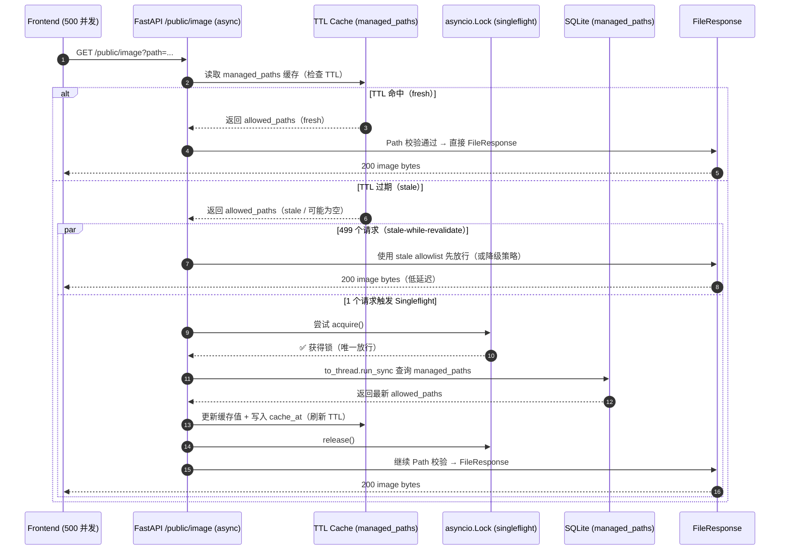

# Neon Crate v1.0.0 核心逻辑蓝图（Mermaid 重绘）

**文档编号**：ARCH-BLUEPRINT-001  
**版本**：v1.0.0  
**最后更新**：2026-03-17  

> 目标：用可在 GitHub/主流 Markdown 渲染器中直接运行的 Mermaid.js 图表，重绘 v1.0.0 的三大“硬核机制”：  
> - **刮削终极流水线**（含 NFO 短路、Year Mirror、TMDB 三梯队、IMDb 防重熔断、归档/就地补录、字幕白嫖、状态机闭环落库）  
> - **/public/image 单飞高并发防御阵列**（Singleflight + TTL Cache + stale-while-revalidate）  
> - **前端 useNeuralLinkStatus 量子态神经中枢**（全局单例 Store + 订阅者模式 + i18n 渲染）  

---

## 图表 1：全量刮削终极流水线（The Ultimate Scrape Pipeline）

```mermaid
graph TD
  A[触发扫描/刮削<br/>POST /scan → POST /scrape_all] --> B{获取物理级并发防重锁<br/>threading.Lock(blocking=False)}
  B -->|锁被占用| B1[拦截并发请求<br/>立即返回（不排队）]
  B -->|锁获取成功| C[获取待刮削任务<br/>get_tasks_needing_scrape()<br/>tasks 热表 + media_archive 冷表]

  C --> D[逐个任务编排器<br/>_process_single_task()]

  %% NFO shortcut branch
  D --> E{[NFO] 短路分支<br/>find_nfo() 命中？}
  E -->|是| E1[解析 NFO（三层装甲）<br/>errors=replace → 生化清洗 → 正则兜底<br/>提取 tmdb_id / imdb_id / title / year]
  E1 --> E2[闭环落库（终态）<br/>status=archived<br/>sub_status=success<br/>is_active=1]
  E2 --> E3[释放锁 & 进入下一个任务]

  %% AI + Year Mirror
  E -->|否| F[AI 提炼文件名<br/>正则去噪 → AI 识别 6 字段证据]
  F --> G[Year Mirror 年份防幻觉护盾<br/>filename_year vs knowledge_year<br/>冲突 → year 置空（模糊搜索）]

  %% TMDB 3-tier fallback
  G --> H{TMDB 三梯队网络降级}
  H --> H1[Tier-1 精确搜索<br/>Title + Year]
  H1 -->|失败| H2[Tier-2 降级搜索<br/>Title only]
  H2 -->|失败| H3[Tier-3 截断降级<br/>Truncated Title]
  H1 -->|成功| I
  H2 -->|成功| I
  H3 -->|成功| I[拿到 tmdb_id / imdb_id / title / year]

  %% IMDb duplicate fuse
  I --> J{IMDb 防重熔断<br/>check_media_exists(imdb_id, type, season, ep)}
  J -->|命中物理副本| J1[继承存量海报<br/>local_poster_path 继承]
  J1 --> J2[闭环落库（终态）<br/>status=ignored<br/>sub_status=success<br/>is_active=1]
  J2 --> J3[进入下一个任务]

  %% Archive vs in-place
  J -->|未重复| K{归档全链路 vs 就地补录}
  K -->|文件来自 library / 已归档| K1[就地补录模式<br/>仅写 NFO/Poster/Fanart<br/>不移动文件]
  K -->|文件来自 downloads| K2[归档全链路<br/>SmartLink: 硬链接→软链接→复制<br/>重命名→写 NFO/Poster/Fanart]

  K1 --> L[闭环落库（终态）<br/>status=archived<br/>sub_status=success<br/>is_active=1]
  K2 --> L

  %% Subtitle local detection
  L --> M[字幕白嫖检测<br/>_check_local_subtitles()<br/>零 API 消耗]
  M --> N[任务完成 → 进入下一个任务]

  %% Visual cues
  classDef ok fill:#00ff9f,stroke:#00e6f6,color:#000;
  classDef warn fill:#f5e642,stroke:#ff3c5a,color:#000;
  classDef bad fill:#ff3c5a,stroke:#00e6f6,color:#fff;
  class E2,J2,L ok;
  class B1 bad;
  class H warn;
```

---

## 图表 2：单飞高并发防御阵列（Singleflight Concurrency Shield）

> 场景：前端 **500 个并发**请求 `/public/image` 拉取海报。目标：在 TTL 内存缓存失效时，**仅允许 1 个协程**访问 DB，其余请求优先走 **stale-while-revalidate**（用旧缓存先放行）。



---

## 图表 3：前端量子态神经中枢（Neural Link State Sync）

```mermaid
graph LR
  subgraph Backend[后端信号源]
    S1[/GET /system/stats/]
    S2[/GET /tasks/*_status/]
    S3[/GET /tasks/list/]
  end

  subgraph Hub[前端量子态枢纽]
    H1[useNeuralLinkStatus<br/>Singleton Store]
    H2[Polling Loop<br/>单例轮询 + AbortController]
    H3[emit() 派发快照<br/>订阅者模式]
  end

  subgraph UI[订阅者（同频渲染）]
    U1[AiSidebar]
    U2[SystemMonitor]
    U3[MiniLog]
  end

  subgraph I18N[i18n 渲染层]
    T1[useLanguage().t]
    T2[动态键保护红线<br/>status_ / sub_status_ / ui_]
  end

  S1 --> H2
  S2 --> H2
  S3 --> H2
  H2 --> H1
  H1 --> H3
  H3 --> U1
  H3 --> U2
  H3 --> U3
  U1 --> T1
  U2 --> T1
  U3 --> T1
  T2 --> T1

  classDef src fill:#16213e,stroke:#00e6f6,color:#00e6f6;
  classDef hub fill:#0f3460,stroke:#00ff9f,color:#00ff9f;
  classDef ui fill:#1a1a2e,stroke:#f5e642,color:#f5e642;
  classDef i18n fill:#3d0000,stroke:#ff3c5a,color:#ff3c5a;

  class S1,S2,S3 src;
  class H1,H2,H3 hub;
  class U1,U2,U3 ui;
  class T1,T2 i18n;
```

