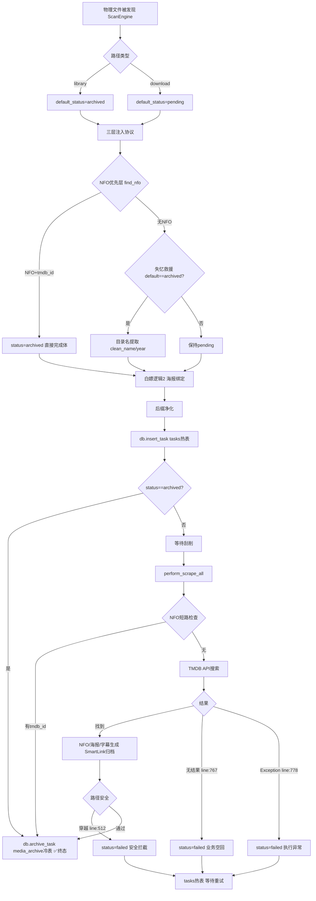
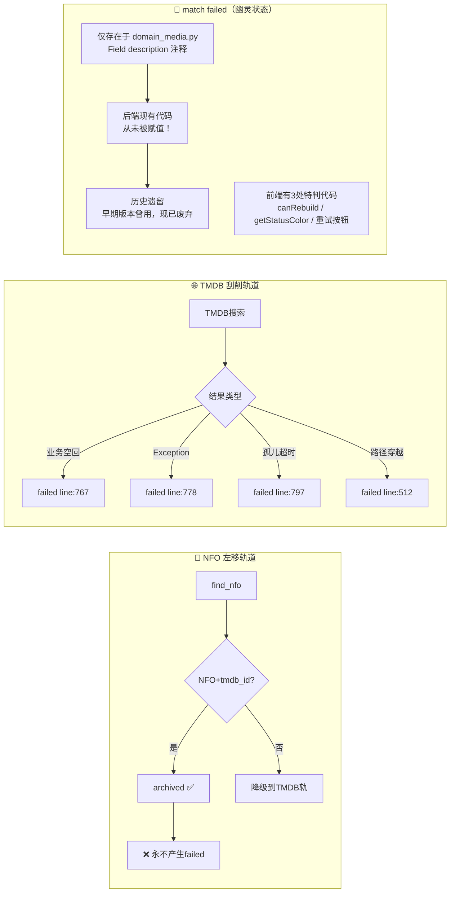

# 全生命周期溯源与状态冗余审计报告

**文档编号**：DEV-RECON-010  
**日期**：2026-03-15  
**GitNexus**：commit `da6f881` ✅  
**状态**：✅ 侦察完成，含归一化可行性评估

---

## 一、系统全生命周期流程图



---

## 二、双轨刮削对比图（failed vs match failed）



---

## 三、血统差异审计

### `"failed"` 的4个赋值来源（均在 scrape_task.py）

| 行号 | 触发条件 | 语义 |
|------|---------|------|
| 512 | 路径穿越安全校验失败 | 程序安全拦截 |
| 767 | TMDB 搜索返回空结果 | **业务空回** |
| 778 | `except Exception` 捕获 | 程序执行异常 |
| 797 | 孤儿 pending 任务超时清理 | 超时清理 |

**`"failed"` 是混合语义状态**，同时承载「业务空回」和「程序异常」。

### `"match failed"` 的赋值来源

**⚠️ 关键发现：后端现有代码中，`"match failed"` 从未被任何函数赋值！**

- 仅出现于 `domain_media.py:66` 的 `Field(description=...)` 注释
- 前端 `canRebuild`、`getStatusColor`、重试按钮均有特判，但逻辑与 `failed` 完全相同
- **结论**：历史遗留状态，早期版本中曾使用，现已被替换为 `"failed"`，前端防御代码未清理

---

## 四、归一化评估

**前端对两者处理逻辑完全相同，归一化 100% 安全。**

| 层级 | 影响 | 风险 |
|------|------|------|
| 后端代码 | 无需修改（本来就不写 match failed） | 零 |
| 前端 canRebuild | 删除 `match failed` 特判 | 零 |
| 前端 getStatusColor | 删除 `match failed` 特判 | 零 |
| 前端重试按钮 | 简化条件 | 零 |
| i18n 字典 | 删除 `status_match_failed` | 零 |
| DB历史记录 | 可选 migration：`UPDATE tasks SET status='failed' WHERE status='match failed'` | 低 |

### 简化后的代码对比

```typescript
// 前
return s === 'archived' || s === 'failed' || s === 'match failed';
// 后
return s === 'archived' || s === 'failed';

// 前
{(task.status === 'failed' || (task.status||'').toLowerCase() === 'match failed') && ...}
// 后
{task.status === 'failed' && ...}
```

---

## 五、点火清单（待机长确认）

| 文件 | 修改 |
|------|------|
| `lib/i18n.ts` | 删除 zh/en 中的 `status_match_failed` |
| `MediaTable.tsx` | canRebuild、getStatusColor、重试按钮删除 `match failed` 特判 |
| `domain_media.py` | Field description 移除 `match failed` |
| 数据库（可选） | `UPDATE tasks SET status='failed' WHERE status='match failed'` |

---

*Neon Crate | DEV-RECON-010 | 2026-03-15*
