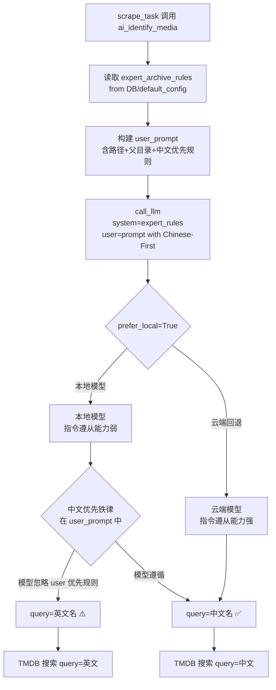
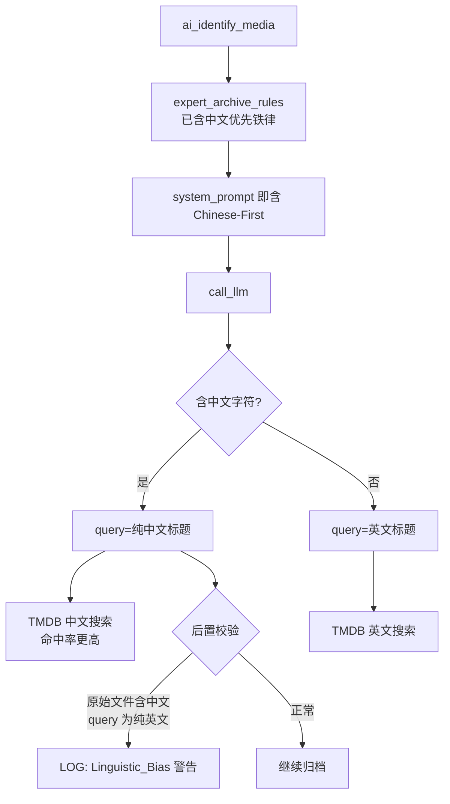

# V16：华语视界优先与 AI 指令集重构侦察报告

**文档编号**：DEV-RECON-012  
**日期**：2026-03-15  
**GitNexus**：commit `da6f881` ✅  
**状态**：✅ 侦察完成，发现现有防护存在覆盖盲区

---

## 一、架构概览：两套独立提示词体系

本系统存在**两套相互独立的 AI 提示词**，解决问题必须同时覆盖两处：

| 提示词 | 文件 | 用途 | 是否含中文优先规则 |
|--------|------|------|-------------------|
| `expert_archive_rules` | `default_config.py` | **归档专家**：清洗文件路径→结构化数据，供 TMDB 搜索 | ⚠️ 仅在 `agent.py` 的 user_prompt 中有，System Prompt 本身无此规则 |
| `master_router_rules` | `default_config.py` | **总控路由**：对话意图识别，提取用户想下载的片名 | ✅ 已有 `clean_name` 使用中文片名的示例 |

---

## 二、问题根因：中文优先规则的位置错误

### 2.1 现状分析

`agent.py` 中 `ai_identify_media` 的调用代码（~line 600）：

```python
raw = await self.llm_client.call_llm(
    system_prompt=expert_rules,   # ← 来自 default_config.py
    prefer_local=True,
    user_prompt=(
        ...
        "6. 中文优先铁律（Chinese-First）：若文件名中存在任何中文字符，"
        "query 必须且只能输出纯中文标题..."
    )
)
```

**问题**：中文优先铁律写在了 `user_prompt` 里，而 **`system_prompt`（即 `expert_archive_rules`）本身没有该规则**。

### 2.2 为什么这是漏洞

```
LLM 优先级：system_prompt > user_prompt

当本地模型（prefer_local=True）的指令遵从能力较弱时：
- system_prompt 的输出格式约束（JSON 契约）可能覆盖了 user_prompt 中的语言规则
- 导致本地模型仍然使用英文作为 query
```

**机长描述的场景**：
```
输入：[刺杀小说家] A.Writer.s.Odyssey.2021.1080p.mkv
当前可能的输出：query: "A Writer's Odyssey"  ← 英文偏好
期望输出：query: "刺杀小说家"  ← 中文优先
```

### 2.3 `expert_archive_rules` 的字段名不一致

`default_config.py` 中 `expert_archive_rules` 使用 `clean_name` 字段：
```json
{"clean_name": "Dune Part Two", "chinese_title": "沙丘2", ...}
```

而 `agent.py` 中 `ai_identify_media` 读取的字段是 `query`：
```python
query = (data.get("query") or data.get("clean_name") or cleaned_name or "").strip()
```

代码有兜底 `data.get("clean_name")`，所以不报错，但**System Prompt 示例中用 `clean_name` 而非 `query`，导致模型行为不一致**。

---

## 三、流程示意图

### 3.1 当前 ai_identify_media 执行流程



### 3.2 修复后期望流程



---

## 四、修改方案（待机长点火）

### Phase 1：将中文优先铁律注入 `expert_archive_rules` System Prompt

**目标文件**：`backend/app/infra/database/default_config.py`

在 `expert_archive_rules` 的 `【最重要的生存法则】` 前插入新章节：

```
【🇨🇳 中文优先铁律 (Chinese-First Mandate) - 最高优先级】
规则一：检测：如果文件路径或文件名中存在任何中文字符（CJK：\u4e00-\u9fff），
        则文件名中的中文部分即为官方中文片名，具有最高可信度。
规则二：query 专用：必须且只能将中文字符串填入 query/clean_name 字段，
        英文译名或音译名严禁进入此字段。
规则三：英文隔离：如文件名中英文同时存在，英文部分仅可填入 original_title 字段作辅助记录，
        绝对禁止进入 clean_name。
规则四：纯净剪裁：提取中文片名时，必须去除中括号 []、制作组名
        （如 HDSky、VXT、OurBits、CHD、WiKi）等噪音，仅保留纯净片名。
规则五：唯有文件路径和文件名中完全不含任何中文字符时，才允许使用英文作为 clean_name。

强制范例：
输入：[刺杀小说家] A.Writer.s.Odyssey.2021.1080p.mkv
→ clean_name: "刺杀小说家", year: "2021", type: "movie"  ✅
→ clean_name: "A Writer's Odyssey"  ❌ 严禁

输入：[沙丘2] Dune.Part.Two.2024.2160p.mkv
→ clean_name: "沙丘2", year: "2024", type: "movie"  ✅

输入：凡人修仙传.Mortal.Journey.S01E01.mp4
→ clean_name: "凡人修仙传", type: "tv", season: 1, episode: 1  ✅
```

### Phase 2：统一 query 字段名

`expert_archive_rules` 中的示例输出将 `clean_name` 统一改为 `query`，与 `agent.py` 的 `data.get("query")` 主路径对齐，消除双重字段名的认知歧义：

```json
{"query": "沙丘2", "year": "2024", "type": "movie"}
```

### Phase 3：后置语言偏差检测（agent.py）

在 `ai_identify_media` 的第五步「提取并规范化数据」后添加：

```python
# ── 